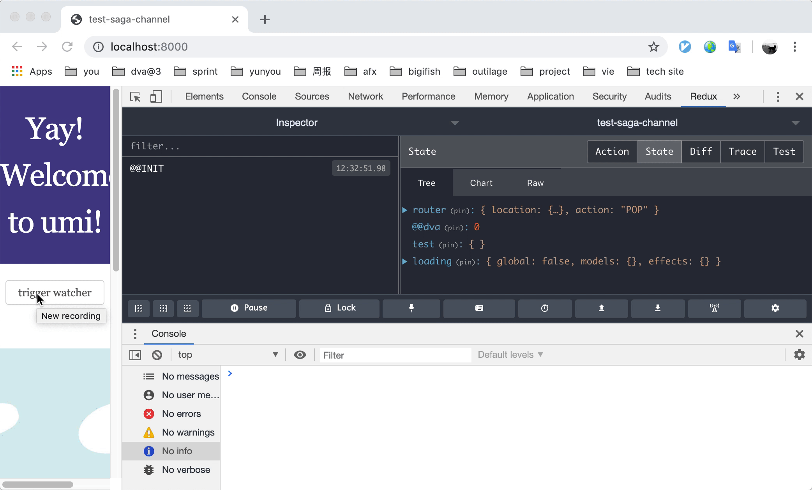

## Demo
有两个 watcher，一个是普通的 watcher，拿到 action 后就打印，作为产兆

一个是利用了 actionChannel 的 watcher
- 消息会被缓存
- 当收到消息后会做打印处理，但是需要耗时 2 s
- 有最多 3 个 "子线程" 会来处理消息，处理完成后又去 chan 中再拿消息出来

比如通过界面点击快速生成了 8 条消息，然后我们通过控制台看到消息被消费的过程：

